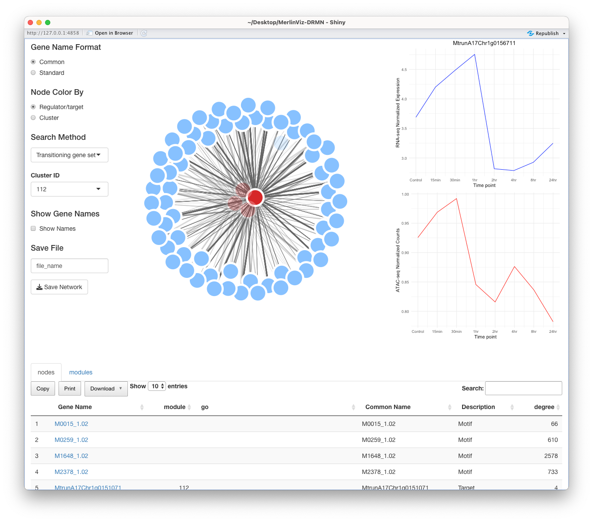
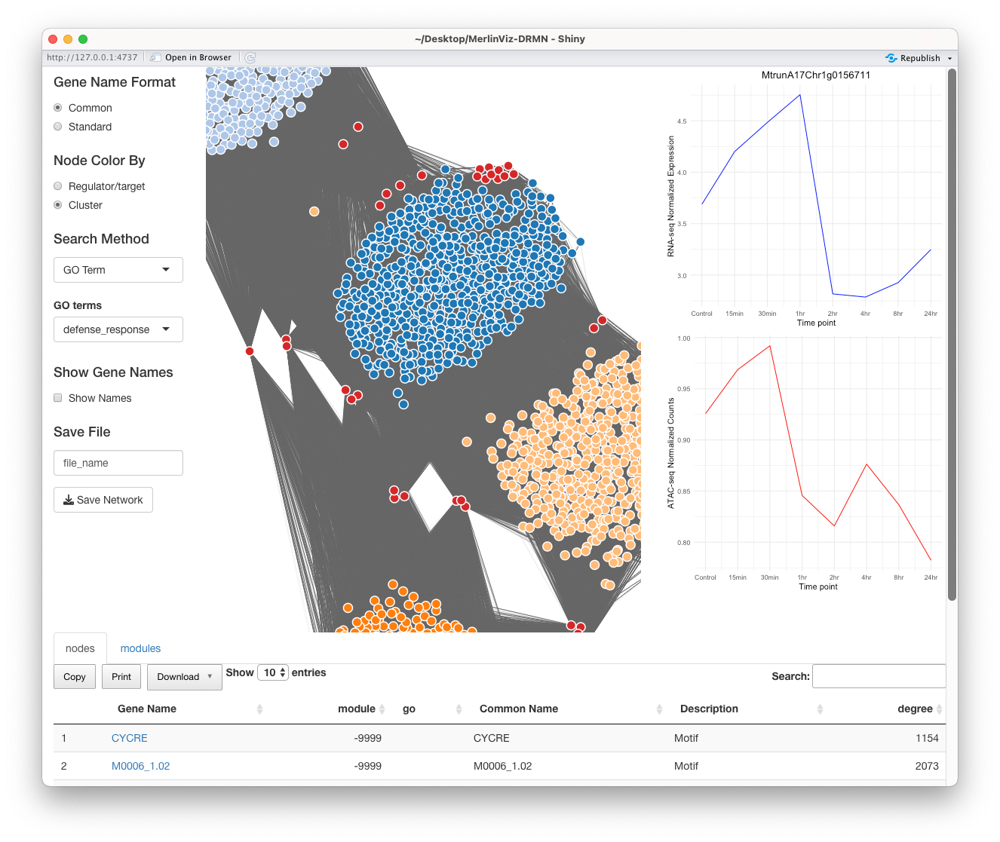

# The MTG-LASSO Network Visualization Tool

### Visualization by Transition gene set.

The webtool opens to a visualization in Example 1 shown below for transitioning gene set (aka. Cluster ID) 112.

At left is the panel of visualization/search options including Gene Name Format "Node Color By" and "Search method." These options will be set to "Common," for common gene names to be included were available, "Regulator/target" for a red and blue color map of regulatory features and target gene nodes, respectively, and "Transitioning gene set" and Cluster ID=112 for this example cluster, also shown in Figure 7B of the manuscript.

At right are two line-plots of gene expression (blue) and aggregated 2 kbp promoter accessibility (red) across the eight-point time-course, respectively. Note data for a chosen member gene of this module (MtrunA17Chr1g0156711) initially be shown, but if you click on any target node for a member gene of this cluster, the data will correspondingly be updated.

The center network visualization presents the inferred edges of motif regulatory feature nodes (red) in the analysis to target gene nodes (blue). This network can be rotated and viewed according to the forceNetwork() visualization function (<https://www.rdocumentation.org/packages/networkD3/versions/0.4/topics/forceNetwork>). The rendering time will be slow for y large sub-graphs for larger clusters with hundreds of member target genes. At the right of the display there is also an option to "Save Network" in several formats: CSV, Excel or .pdf image.

At the bottom are two tabs, "Nodes" and "Modules" Under the nodes tab will be a list of the regulatory motif features inferred with MTG-LASSO for this transitioning gene set (either having a Human-readable motif name or CisBP motif ID), and the member target gene names (generally systematic names from the v5 genome assembly with some common names available). For each of the member target genes there will also be GO terms and regulators associated with that gene indicated in the table below. In the "Modules" tab there will a table summary of the modules and associated member genes shown in the visualization, and the enrichments associated with those terms. These data can be downloaded/saved. 

```{r, out.width='85%', fig.align='center', fig.cap='__Example 1__: Opening visualization of an example transitioning gene set, i.e., module 112 from Figure 7B in the manuscript.', message=FALSE, warning=FALSE, echo=FALSE}

```

```{r fig.align='center', fig.cap='__Example 2__: Visualization of genes in transitinging gene set clusters enriched (hypergeometric test q<0.05) for the Gene Ontology “defense response” annotation term. Note the “Node Color By” option is turned to “Cluster” to color target genes by cluster', message=FALSE, warning=FALSE, echo=FALSE, out.width='85%'}

```
